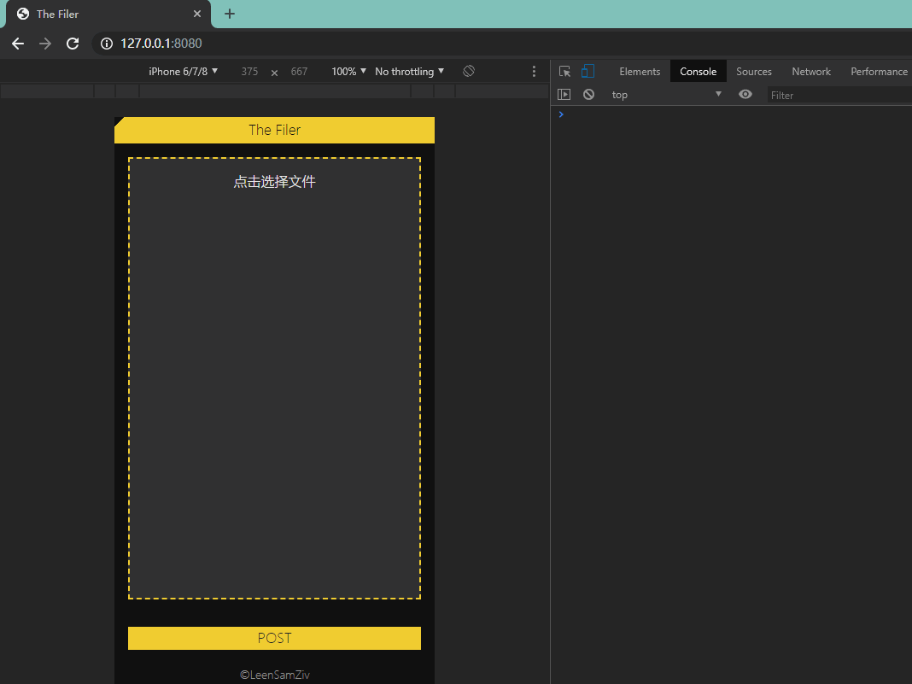

# The Filer

## 简介

> 局域网文件上传

> 服务端从 `D:/_the_filer_upload/` 取得文件

## 运行&编译环境

> Maven `3.6.1`

> Java `1.8.0_201`

> Vue `2.6.10`

## 使用步骤

> 执行 `mvn clean package` 以编译程序

> 执行 `filer` 以启动程序

> 终端访问 `[ip:8080]` 以选择＆上传文件

## 配置

> 文件保存路径 `src\main\resources\application.properties -> file.path`
