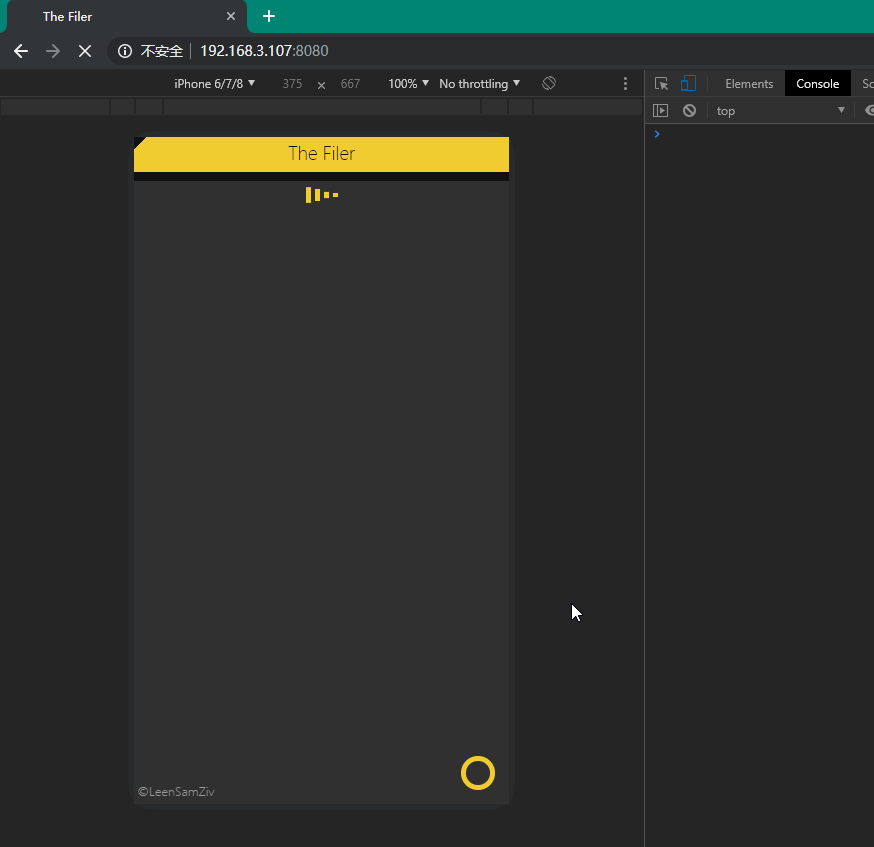

# The Filer

## 环境
> JAVA `[1.8.0_201]`

## 简介

> 局域网文件上传

## 使用步骤

> 服务端运行程序

> 客户终端访问`[ip:8080]`

> 选择＆上传文件

> 服务端从`[D:/_the_filer_upload/]`取得文件

##配置

>`[src\main\resources\application.properties]`->`[file.path]`:文件保存路径 
